# 🌍 Sustainability & Climate Change — Complete Mindmap

> **The Master Mental Model**: Human activity → resource extraction & emissions → environmental change → climate/ecological impacts → social & economic consequences → need for sustainable development → measurement → policy/markets → technological & operational solutions.

---

## 🗺️ Master Overview Mindmap

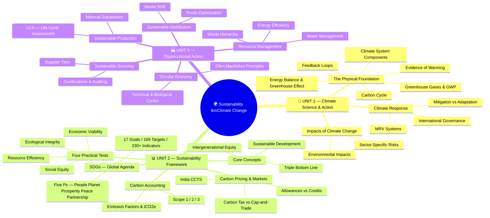

---

## 🔬 UNIT 1 — The Science of Climate Change (Detailed)

```mermaid
mindmap
  root(("🔬 UNIT 1\nClimate Science"))
    🌡️ Key Distinctions
      Weather
        Short-term atmospheric conditions
        Specific place & time
      Climate
        Long-term pattern of weather
        Statistical averages over 30+ years
      Climate Change
        Broad long-term change in climate system
        IPCC definition — any change over time
        UNFCCC definition — emphasizes human influence
      Global Warming
        Specifically the long-term rise in average global temperature
    🌐 Earth as a System
      Atmosphere
        Gases surrounding Earth
        Contains greenhouse gases
      Hydrosphere
        Oceans, rivers, lakes
        Ocean = huge heat buffer
      Cryosphere
        Ice sheets, glaciers, sea ice, permafrost
        Albedo effect — reflects sunlight
      Lithosphere
        Rocks, soil, sediments
        Stores carbon in geological formations
      Biosphere
        Living organisms
        Forests as carbon sinks
      System Behaviour
        Nodes interact continuously
        Exchange heat, water, carbon
        Feedback loops amplify changes
    ☀️ Energy Balance
      Incoming Solar Radiation
        Provides energy to Earth
      Albedo Effect
        Clouds, ice, bright surfaces reflect sunlight
      Absorption & Re-emission
        Earth absorbs remainder
        Re-emits as infrared radiation
      Natural Greenhouse Effect
        GHGs absorb outgoing IR
        Re-radiate back to surface
        Without it — Earth would be minus 18C
        With it — Earth is roughly plus 15C
      The Problem
        NOT the greenhouse effect itself
        Human AMPLIFICATION of it
    💨 Greenhouse Gases
      CO2 — Carbon Dioxide
        Dominant due to enormous quantities
        Long atmospheric lifetime
        Pre-industrial 280 ppm to now 420+ ppm
      CH4 — Methane
        More potent per molecule than CO2
        Shorter-lived
        Sources — agriculture, wetlands, fossil fuels
      N2O — Nitrous Oxide
        Even more potent than methane
        Agriculture, industrial processes
      SF6 — Sulfur Hexafluoride
        Extremely high GWP
        Industrial applications
      GWP — Global Warming Potential
        Converts all gases to CO2-equivalent
        Common unit for comparison
        Depends on time horizon
    📈 Evidence of Warming
      Thermometer Records
        Direct temperature measurements
      Ice Cores
        Extend record 800,000 years
        Trapped air bubbles show past CO2
      Keeling Curve
        Continuous CO2 at Mauna Loa since 1958
        Shows relentless long-term increase
      Satellites
        Global temperature monitoring
      Glacier Observations
        Worldwide retreat documented
      Sea-Level Measurements
        Thermal expansion plus ice melt
      Proxy Data
        Tree rings and corals
        Independent confirmation
    🔄 Carbon Cycle
      Fast Carbon Cycle
        Days to centuries
        Atmosphere to biosphere to ocean surface
        Photosynthesis, respiration, decomposition
      Slow Geological Cycle
        Thousands to millions of years
        Rock weathering, sedimentation
        Fossil fuels locked away
      Human Disruption
        Took carbon from slow cycle
        Rapidly injected into fast cycle
        Fossil fuel combustion
        Deforestation — releases stored carbon AND destroys sinks
      Planetary Accounting
        Natural — sources approx equal sinks
        Human — additional sources exceed sink capacity
        Result — atmospheric CO2 rises
    🔁 Feedback Loops
      Ice-Albedo Feedback — POSITIVE
        Warming then ice melts
        Less sunlight reflected
        More solar energy absorbed
        More warming
      Permafrost Feedback — POSITIVE
        Warming then permafrost thaws
        CH4 and CO2 released
        More warming then more thawing
      Water Vapour Feedback — POSITIVE
        Warming then more evaporation
        Water vapour is a GHG
        More warming
      Why It Matters
        Makes climate change NONLINEAR
        Small changes can trigger cascading effects
        Connects to CS — modelling and AI
    🏭 Human Causes
      Fossil Fuel Combustion
        Coal, oil, natural gas
        Energy, transport, industry
      Deforestation
        Releases stored carbon
        Destroys future carbon sinks
      Industrial Activity
        Cement, steel, chemicals
      Agriculture
        Methane from livestock & rice
        N2O from fertilizers
      Land-Use Change
        Converting forests, wetlands
      Key Fact
        Dominant driver since circa 1950
        Natural factors insufficient to explain observed warming
```

---

## 🌪️ UNIT 1 — From Science to Climate Action (Detailed)

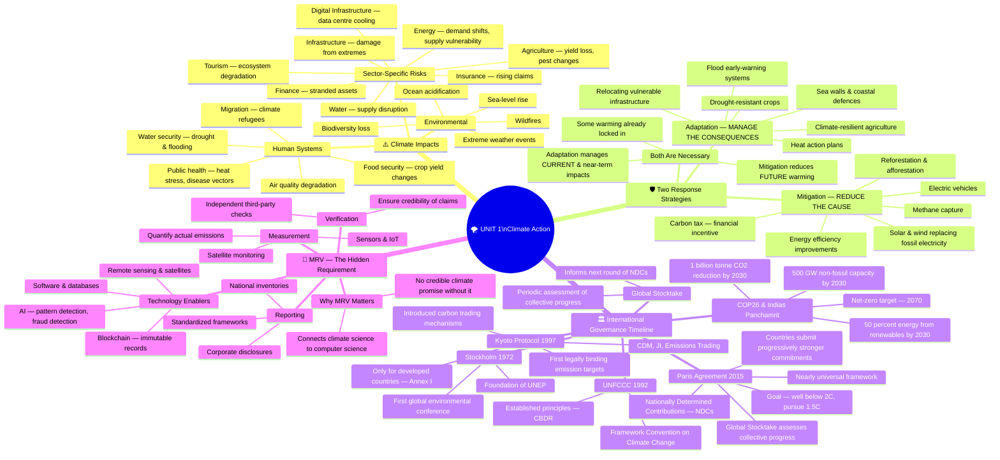

---

## 📊 UNIT 2 — Sustainability Framework (Detailed)

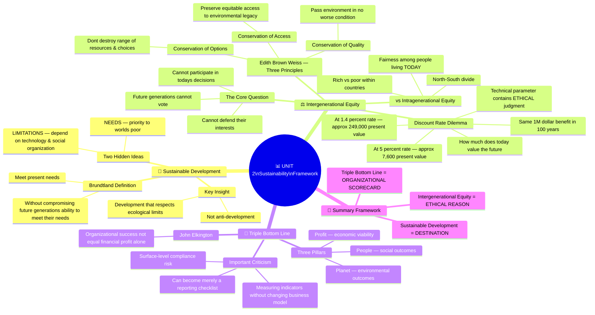

---

## 🧪 UNIT 2 — Four Practical Tests of Sustainability (Detailed)

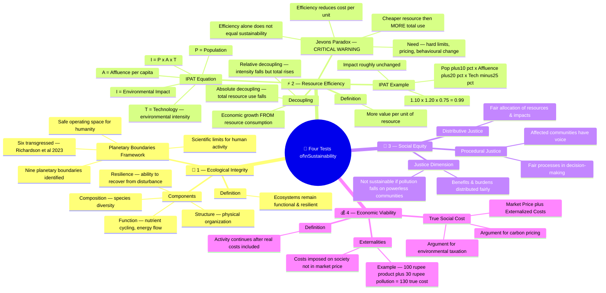

---

## 🎯 UNIT 2 — SDGs: Global Agenda (Detailed)

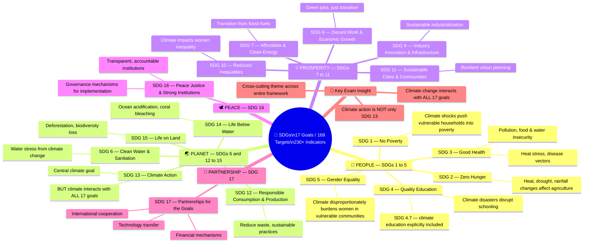

---

## 📦 UNIT 2 — Carbon Accounting (Detailed)

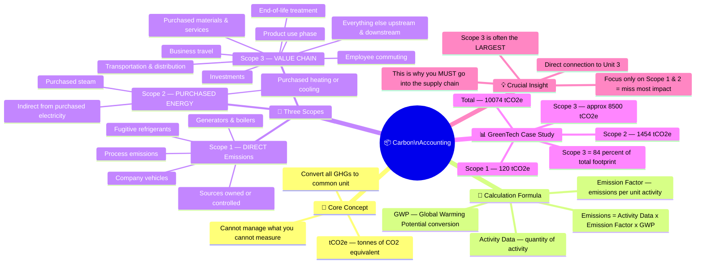

---

## 💹 UNIT 2 — Carbon Pricing & Markets (Detailed)

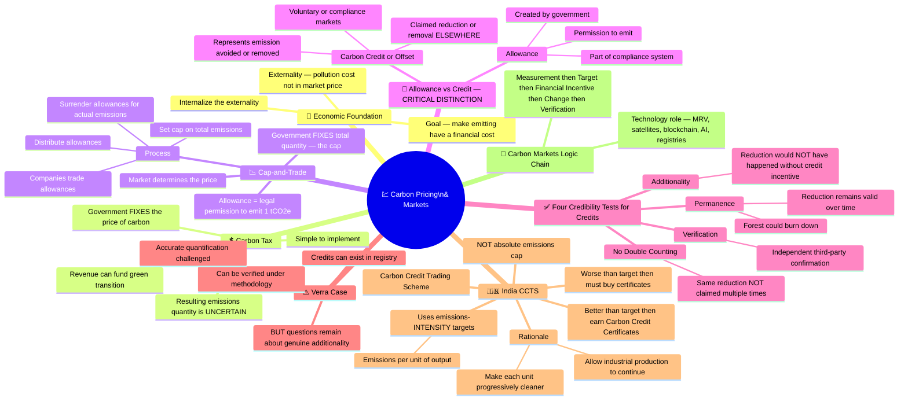

---

## 🏭 UNIT 3 — Sustainable Sourcing (Detailed)

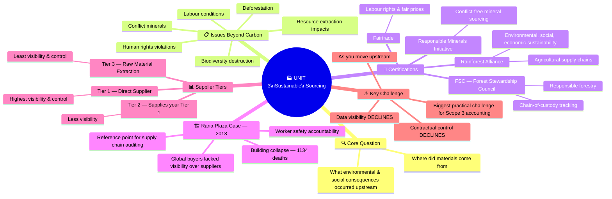

---

## ⚙️ UNIT 3 — Sustainable Production & LCA (Detailed)

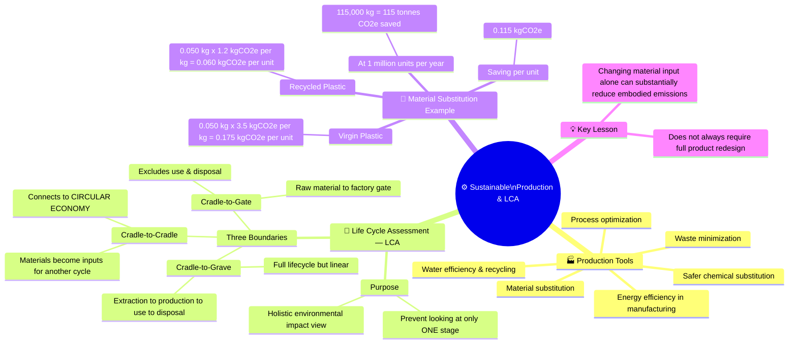

---

## 🚛 UNIT 3 — Sustainable Distribution (Detailed)

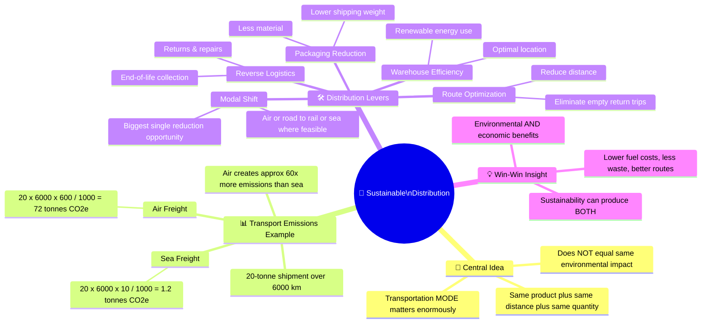

---

## 🔋 UNIT 3 — Resource Management (Detailed)

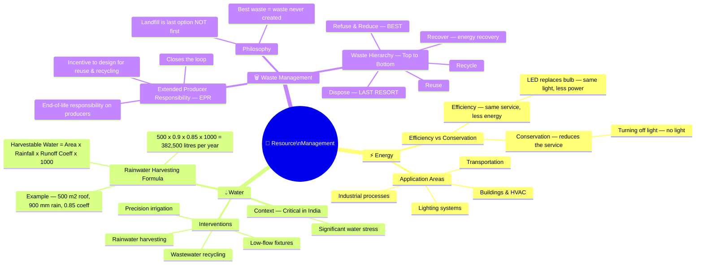

---

## ♻️ UNIT 3 — Circular Economy (Detailed)

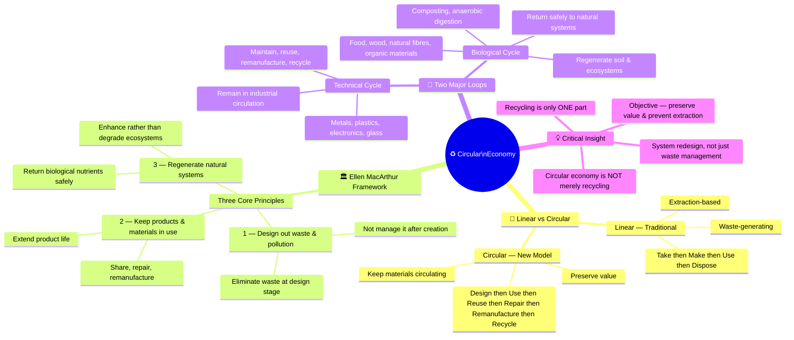

---

## 🔗 The Complete Architecture — All Units Connected

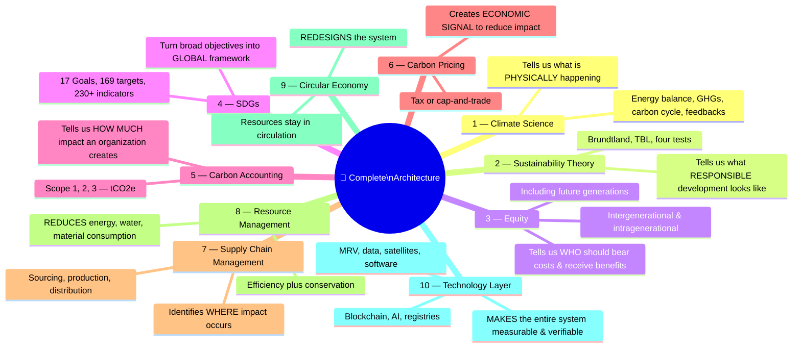

---

## 📱 The Smartphone Test — Connecting Everything

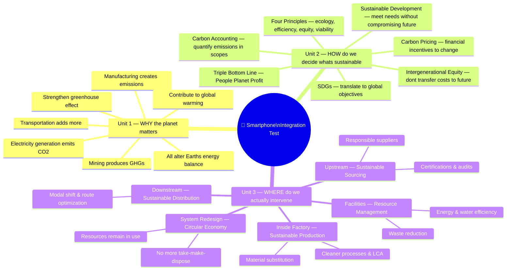

---

> **Exam Strategy**: When you see any question, locate it on this map. Every concept connects to the master chain. Reconstruct the answer from the underlying logic — don't memorize isolated definitions.
